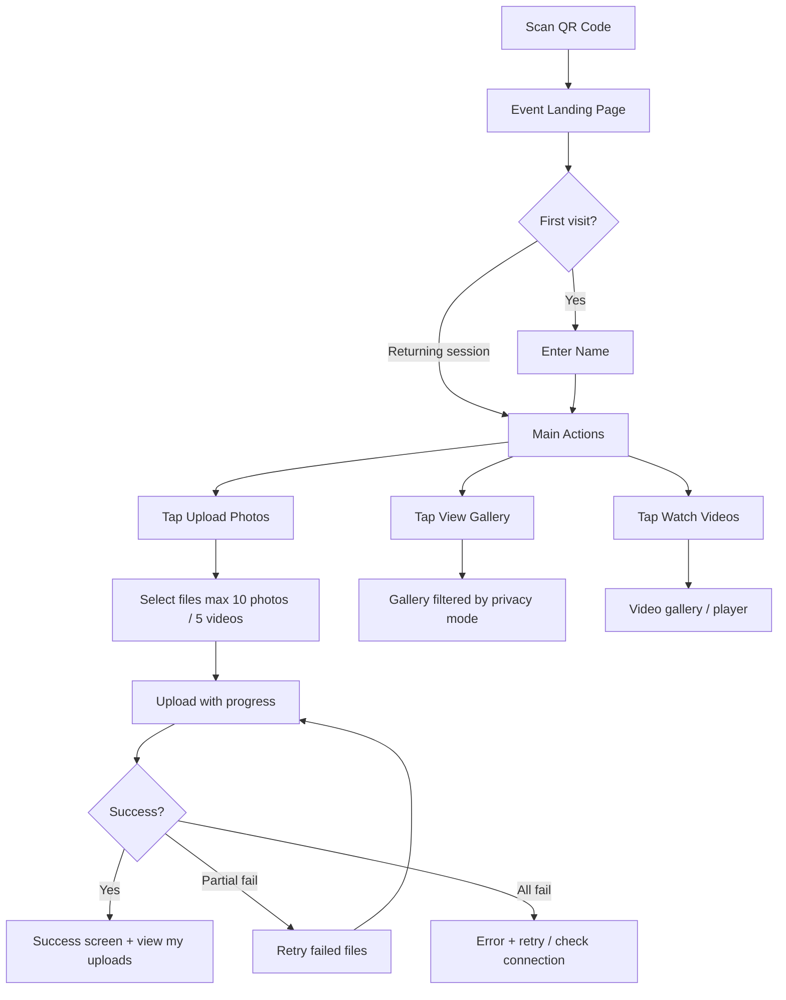
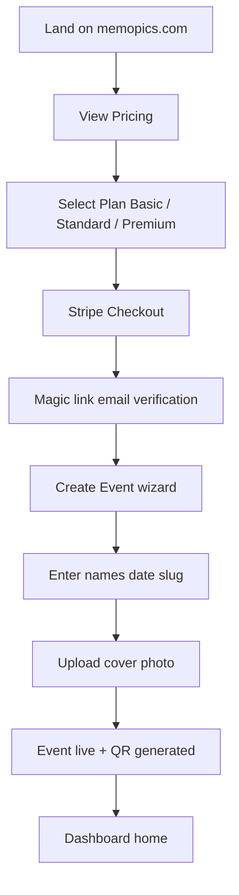
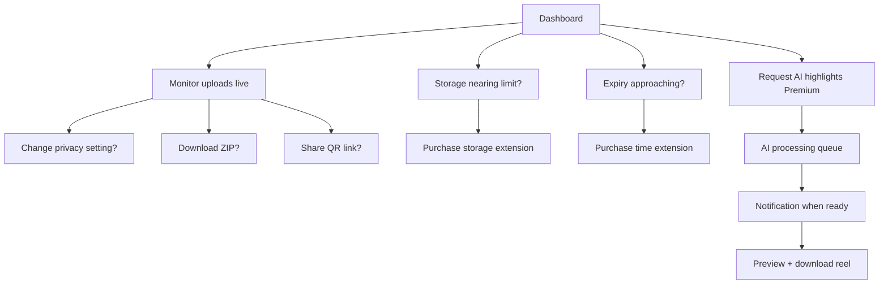
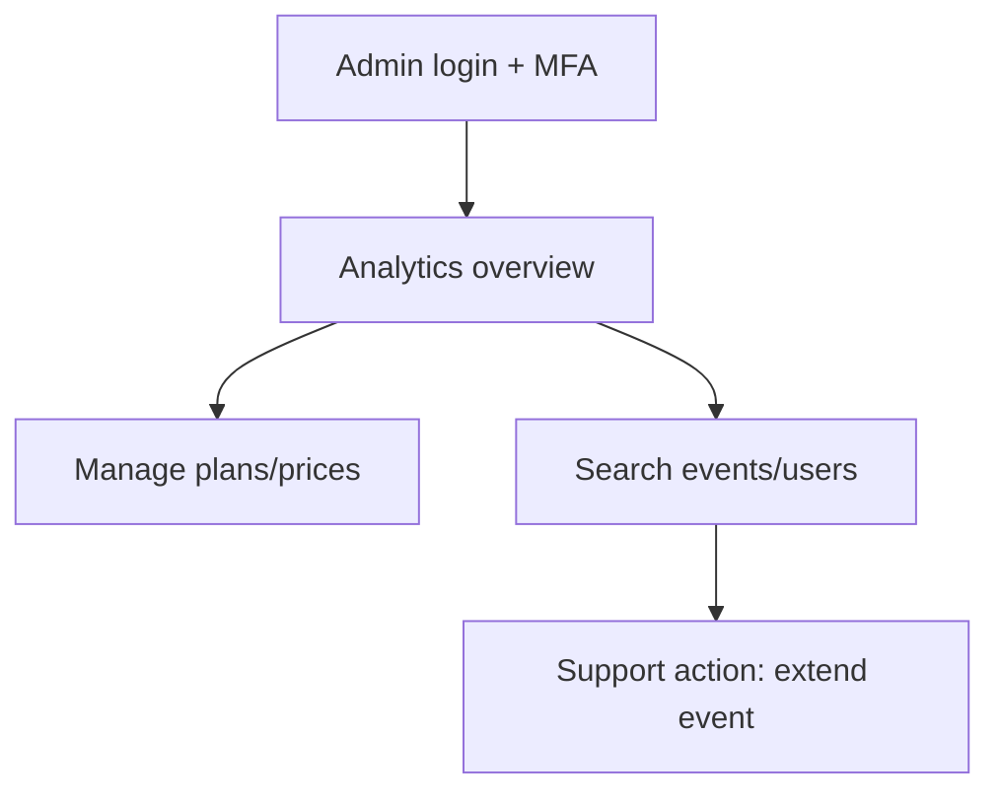

# Stage 2 — UI/UX Design

**Project:** Memopics  
**Status:** Finalized — design specification only, no application code  
**Version:** 2.1 (post-refinement)  
**Inputs:** Stage 0 business decisions + Stage 1 architecture (Next.js, Tailwind, shadcn/ui, EN + EL)

---

## Table of Contents

1. [Design Philosophy](#1-design-philosophy)
2. [Brand Direction](#2-brand-direction)
3. [Design System Decisions](#3-design-system-decisions)
4. [Design Tokens](#4-design-tokens)
5. [Typography](#5-typography)
6. [Layout & Responsive Strategy](#6-layout--responsive-strategy)
7. [User Flows](#7-user-flows)
8. [Information Architecture & Page Structure](#8-information-architecture--page-structure)
9. [Mobile-First Layouts](#9-mobile-first-layouts)
10. [Component Planning](#10-component-planning)
11. [Guest Experience](#11-guest-experience)
12. [Couple Dashboard Experience](#12-couple-dashboard-experience)
13. [Platform Admin UX](#13-platform-admin-ux)
14. [Accessibility & i18n](#14-accessibility--i18n)
15. [Motion & Interaction](#15-motion--interaction)
16. [Stage 2 Decisions Requiring Approval](#16-stage-2-decisions-requiring-approval)
17. [Stage 2 Final Refinements (v2.1)](#17-stage-2-final-refinements-v21)

---

## 1. Design Philosophy

### 1.1 Core UX Principles

| Principle | Meaning for Memopics |
|---|---|
| **Guest-first speed** | A guest at a wedding table must upload in under 30 seconds after scanning QR |
| **Speed over animation** | Loading performance prioritized on event pages; animations never block interaction |
| **Luxury without complexity** | Premium visual language; zero learning curve; minimal text after QR scan |
| **Mobile-first, desktop-elegant** | 85%+ of guest traffic is phone; couple dashboard must also work on desktop |
| **Trust through clarity** | Privacy defaults visible; storage limits honest; no dark patterns |
| **Emotion-led, function-backed** | Event pages feel celebratory; dashboards feel calm and organized |

### 1.2 Three Experience Modes

Memopics has three distinct UI modes sharing one design system but different emotional weight:

```
┌─────────────────────────────────────────────────────────────────┐
│  MARKETING          │  GUEST (Event)       │  DASHBOARD          │
│  Acquire couples    │  Capture memories    │  Manage & download  │
│  Brand-forward      │  Emotion-forward     │  Utility-forward    │
│  Full Memopics brand│  Couple-branded page │  Memopics admin shell │
└─────────────────────────────────────────────────────────────────┘
```

**Decision:** Guest event pages are **couple-branded** (their names, cover photo, date dominate). Memopics branding is subtle ("Powered by Memopics" footer). Marketing and dashboards use full Memopics brand.

**Why:** Couples pay for a premium experience that feels personal, not like a generic SaaS tool at their wedding.

---

## 2. Brand Direction

### 2.1 Positioning Statement

> **Memopics** is the premium digital memory platform for life's most important gatherings — where every guest contributes, and every moment is preserved with elegance.

**Not:** A cheap upload box, a wedding planner app, or a social network.

### 2.2 Brand Personality

| Attribute | Expression |
|---|---|
| **Elegant** | Serif headlines, generous whitespace, restrained color |
| **Warm** | Mediterranean-inspired neutrals (not cold Silicon Valley gray) |
| **Trustworthy** | Clear privacy labels, visible security cues, honest limits |
| **Modern** | Clean UI components, smooth motion, no clip-art wedding clichés |
| **Celebratory** | Event pages feel like a digital invitation, not a form |

### 2.3 Brand Direction Options Considered

| Direction | Description | Pros | Cons | Verdict |
|---|---|---|---|---|
| **A. Classic Wedding** | Blush pink, script fonts, floral motifs | Familiar to wedding market | Hard to extend to corporate/baptisms; feels dated | ❌ |
| **B. Silicon SaaS** | Blue/gray, generic sans-serif | Scalable, safe | Fails premium positioning; forgettable | ❌ |
| **C. Modern Mediterranean Luxury** ✅ | Ivory, charcoal, champagne gold accent | Fits CY/GR launch; timeless; extends to other events | Requires discipline to avoid "gold = cheap" | ✅ **Selected** |
| **D. Dark Editorial** | Black backgrounds, high contrast | Distinctive, luxury fashion feel | Poor outdoor QR scan readability in sunlight | ❌ for guest pages |

### 2.4 Selected Brand Direction: Modern Mediterranean Luxury

**Visual metaphor:** A high-end wedding invitation printed on cotton paper — not glossy, not cluttered.

**Mood board keywords:** Sunlit terrace, linen texture, soft gold foil stamp, olive grove, evening candlelight.

**Logo direction (for Stage 3 implementation):**
- Wordmark: **Memopics** in refined serif or serif/sans hybrid
- Icon: Abstract overlapping frames or aperture suggesting collected perspectives
- Minimum clear space: 1× cap height on all sides
- Never: hearts, rings, camera clip-art in logo

### 2.5 Event Page Theming (Future-Ready)

MVP ships one wedding theme. Architecture supports theme variants:

| Theme key | Primary use | Accent |
|---|---|---|
| `classic` (MVP default) | Weddings | Champagne gold |
| `celebration` | Birthdays, baptisms | Soft coral |
| `corporate` | Business events | Slate blue |
| `minimal` | Any | Monochrome |

Couple can customize: cover image, names, date, optional accent override (Premium later).

---

## 3. Design System Decisions

### 3.1 Foundation Stack

| Layer | Choice | Rationale |
|---|---|---|
| CSS framework | **Tailwind CSS v4** | Token-based; mobile-first utilities; matches Stage 1 |
| Component base | **shadcn/ui** | Accessible Radix primitives; customizable; no vendor lock-in |
| Icons | **Lucide React** | Consistent stroke; extensive set |
| Fonts | **Google Fonts** (self-hosted via `next/font`) | Greek (EL) character support critical for CY/GR |

### 3.2 shadcn/ui Customization Strategy

shadcn/ui defaults are neutral/gray — **must be re-themed** to Memopics tokens.

| shadcn token | Memopics mapping |
|---|---|
| `--background` | `ivory-50` |
| `--foreground` | `charcoal-900` |
| `--primary` | `gold-600` |
| `--primary-foreground` | `ivory-50` |
| `--secondary` | `stone-100` |
| `--muted` | `stone-200` |
| `--accent` | `gold-100` |
| `--destructive` | `rose-700` |
| `--border` | `stone-200` |
| `--radius` | `0.75rem` (12px) — soft, not pill-shaped |

**Decision:** Use shadcn for **dashboard and marketing** components. Guest event pages use **custom layout components** built on the same tokens for more editorial freedom.

**Why:** Dashboard needs tables, dialogs, forms (shadcn strength). Event landing pages need full-bleed hero layouts that shadcn templates don't provide out of the box.

### 3.3 Component Architecture (Atomic)

```
packages/ui/  (future Stage 3)
├── tokens/           # CSS variables, Tailwind config
├── primitives/       # shadcn base (Button, Input, Dialog…)
├── patterns/         # UploadZone, MediaGrid, StorageMeter
├── layouts/          # DashboardShell, EventPageShell, MarketingLayout
└── composites/       # QRCard, PlanCard, GalleryViewer
```

---

## 4. Design Tokens

### 4.1 Color Palette

#### Brand Colors

| Token | Hex | Usage |
|---|---|---|
| `ivory-50` | `#FDFBF7` | Page backgrounds |
| `ivory-100` | `#F9F5EE` | Card backgrounds, alternate sections |
| `stone-200` | `#E8E2D9` | Borders, dividers |
| `stone-400` | `#A89F91` | Placeholder text, meta labels |
| `charcoal-800` | `#2C2825` | Body text |
| `charcoal-900` | `#1A1714` | Headlines |
| `gold-100` | `#F5EDD8` | Subtle highlights, badge backgrounds |
| `gold-400` | `#C9A962` | Decorative accents, progress fills |
| `gold-600` | `#A68B4B` | Primary buttons, links, focus rings |
| `gold-700` | `#8A7340` | Primary hover |
| `olive-600` | `#5C6B4F` | Success states (Mediterranean green) |
| `rose-700` | `#9B4D4D` | Errors, destructive actions |
| `amber-500` | `#D4A017` | Warnings (storage almost full) |

#### Semantic Colors

| Semantic | Token | When |
|---|---|---|
| Success | `olive-600` | Upload complete, payment success |
| Warning | `amber-500` | Storage > 80%, expiry < 7 days |
| Error | `rose-700` | Upload failed, payment failed |
| Info | `stone-400` | Helper text |

**Decision:** Avoid pure `#FFD700` gold — reads cheap. Use muted champagne gold.

**Dark mode:** Not in MVP. Guest pages are always light (outdoor readability). Dashboard dark mode deferred to V2.

### 4.2 Spacing Scale

Base unit: **4px**

| Token | Value | Common use |
|---|---|---|
| `space-1` | 4px | Tight icon gaps |
| `space-2` | 8px | Inline spacing |
| `space-3` | 12px | Form field gaps |
| `space-4` | 16px | Card padding (mobile) |
| `space-6` | 24px | Section gaps |
| `space-8` | 32px | Card padding (desktop) |
| `space-12` | 48px | Section margins |
| `space-16` | 64px | Hero padding |
| `space-24` | 96px | Marketing section breaks |

### 4.3 Border Radius

| Token | Value | Use |
|---|---|---|
| `radius-sm` | 6px | Chips, tags |
| `radius-md` | 12px | Buttons, inputs, cards |
| `radius-lg` | 16px | Modals, large cards |
| `radius-xl` | 24px | Event page hero card overlay |
| `radius-full` | 9999px | Avatars, progress dots |

### 4.4 Shadows

| Token | Value | Use |
|---|---|---|
| `shadow-soft` | `0 2px 8px rgba(26,23,20,0.06)` | Cards at rest |
| `shadow-lift` | `0 8px 24px rgba(26,23,20,0.10)` | Hover, modals |
| `shadow-hero` | `0 16px 48px rgba(26,23,20,0.15)` | QR card, floating CTAs |

**Decision:** Warm-tinted shadows (charcoal base), not pure black — matches ivory palette.

### 4.5 Z-Index Scale

| Layer | z-index |
|---|---|
| Base content | 0 |
| Sticky header | 40 |
| Upload progress bar (sticky bottom) | 50 |
| Overlay / drawer | 60 |
| Modal | 70 |
| Toast notifications | 80 |

---

## 5. Typography

### 5.1 Font Pairing Options Considered

| Pairing | Headlines | Body | Greek support | Verdict |
|---|---|---|---|---|
| Playfair + Inter | Classic luxury | Excellent readability | ✅ | Good alternative |
| **Cormorant Garamond + DM Sans** ✅ | Editorial elegance | Clean, modern | ✅ | **Selected** |
| Fraunces + Source Sans 3 | Distinctive | Good | ✅ | Headlines too quirky for dashboard |

### 5.2 Selected Typography

| Role | Font | Weight | Notes |
|---|---|---|---|
| **Display / H1** | Cormorant Garamond | 500–600 | Event names, marketing heroes |
| **Headings H2–H4** | DM Sans | 600 | Dashboard sections |
| **Body** | DM Sans | 400 | All UI text, guest flows |
| **Labels / UI** | DM Sans | 500 | Buttons, nav, form labels |
| **Monospace** | JetBrains Mono | 400 | URLs, slugs, admin IDs |

### 5.3 Type Scale (Mobile → Desktop)

| Style | Mobile | Desktop | Line height | Use |
|---|---|---|---|---|
| `display-xl` | 40px | 56px | 1.1 | Event hero names |
| `display-lg` | 32px | 44px | 1.15 | Marketing H1 |
| `heading-xl` | 28px | 36px | 1.2 | Dashboard page titles |
| `heading-lg` | 24px | 28px | 1.25 | Section headers |
| `heading-md` | 20px | 22px | 1.3 | Card titles |
| `body-lg` | 18px | 18px | 1.6 | Event page intro text |
| `body-md` | 16px | 16px | 1.5 | Default body |
| `body-sm` | 14px | 14px | 1.5 | Meta, captions |
| `label-sm` | 12px | 12px | 1.4 | Badges, timestamps |

**Decision:** Event hero names use serif display; all interactive UI uses sans-serif for clarity.

### 5.4 Typographic Rules

- Maximum line length: **65 characters** for body text
- Headlines on event pages: **centered**
- Dashboard text: **left-aligned**
- ALL CAPS only for micro-labels (e.g., "STORAGE", "EXPIRES IN") — never paragraphs
- Greek (EL): same fonts; verify glyph rendering in Stage 3; avoid condensed faces

---

## 6. Layout & Responsive Strategy

### 6.1 Breakpoints

| Name | Min width | Primary audience |
|---|---|---|
| `xs` | 0 | Phone portrait (guest default) |
| `sm` | 640px | Phone landscape, small tablets |
| `md` | 768px | Tablet |
| `lg` | 1024px | Desktop dashboard |
| `xl` | 1280px | Wide dashboard, marketing |
| `2xl` | 1536px | Marketing hero max-width |

**Mobile-first rule:** All layouts designed at 375px width first (iPhone SE / standard Android), then enhanced.

### 6.2 Touch & Interaction Targets

| Element | Minimum size | Spacing |
|---|---|---|
| Primary button | 48px height | Full-width on mobile guest pages |
| Secondary/icon button | 44×44px | 8px gap between tappable items |
| Gallery thumbnail | 80×80px minimum | 2px gap in grid |
| Upload drop zone | 200px min height | Entire zone tappable |
| Form inputs | 48px height | 16px vertical margin |

**Decision:** Guest CTAs are **full-width sticky bottom buttons** on mobile — thumb-reachable at wedding tables.

### 6.3 Grid Systems

| Context | Grid |
|---|---|
| Marketing | 12-col, max-width 1200px centered |
| Event landing | Single column, max-width 480px centered (phone card feel) |
| Guest gallery | 3-col mobile, 4-col tablet, 5-col desktop |
| Dashboard | Sidebar + main; sidebar collapses to bottom nav on mobile |

### 6.4 Safe Areas

- Respect `env(safe-area-inset-*)` for notched phones
- Sticky bottom CTAs sit above home indicator
- PWA standalone mode tested on iOS Safari

---

## 7. User Flows

### 7.1 Guest Flow (Primary — Highest Priority)



**Target:** Scan to first successful upload in **≤ 4 taps**, **≤ 60 seconds** on 4G.

**Session behavior:** Name entered once per 24h session. Returning guests skip name entry.

### 7.2 Couple Flow — First-Time Purchase



**Create Event wizard:** 3 steps maximum — (1) Details, (2) Cover, (3) Confirm & launch.

### 7.3 Couple Flow — Event Day & After



### 7.4 Platform Admin Flow (Minimal MVP)



---

## 8. Information Architecture & Page Structure

### 8.1 Site Map

```
memopics.com/
├── /                          Marketing homepage
├── /pricing                   Plans (€29 / €59 / €129)
├── /how-it-works              Product explanation
├── /faq
├── /privacy
├── /terms
├── /contact
├── /auth/verify               Magic link landing
│
├── /[slug]                    ★ Event landing (public)
├── /[slug]/upload             Guest upload flow
├── /[slug]/gallery            Guest gallery
├── /[slug]/videos             Guest video section
│
├── /dashboard                 Couple home (auth required)
├── /dashboard/events/new      Create event (post-purchase)
├── /dashboard/events/[id]     Event overview
├── /dashboard/events/[id]/media       Full gallery manager
├── /dashboard/events/[id]/settings    Event settings
├── /dashboard/events/[id]/downloads     Export center
├── /dashboard/events/[id]/qr            QR & sharing
├── /dashboard/events/[id]/billing       Plan & extensions
├── /dashboard/events/[id]/ai            AI jobs (Premium)
├── /dashboard/account         Account settings
│
└── /admin/...                 Platform admin (MFA)
    ├── /admin/analytics
    ├── /admin/plans
    ├── /admin/events
    └── /admin/users
```

### 8.2 Page Priority for MVP (Stage 3)

| Priority | Pages |
|---|---|
| P0 | Event landing, guest upload, guest gallery, couple dashboard overview, create event, QR page |
| P1 | Marketing homepage, pricing, Stripe success, settings, downloads |
| P2 | Videos section, AI page, marketing FAQ, admin analytics |
| P3 | Platform admin plan editor |

### 8.3 Navigation Models

| Area | Mobile nav | Desktop nav |
|---|---|---|
| Marketing | Hamburger → drawer | Top nav links + CTA |
| Event (guest) | Bottom bar: Upload / Gallery / Videos | Same, centered max-width |
| Couple dashboard | Bottom tab bar (4 tabs) | Left sidebar (240px) |
| Platform admin | Collapsed sidebar | Full sidebar |

**Dashboard mobile tabs:**
1. **Home** — event overview
2. **Gallery** — all media
3. **Share** — QR & link
4. **More** — settings, billing, downloads, AI

---

## 9. Mobile-First Layouts

### 9.1 Event Landing Page (`/[slug]`) — 375px

```
┌─────────────────────────────────┐
│ ░░░░░ COVER IMAGE ░░░░░░░░░░░░ │  ← 60vh full-bleed
│ ░░░░░░░░░░░░░░░░░░░░░░░░░░░░░ │
│         ┌─────────────┐         │
│         │  soft overlay card   │
│         │  Demetris &           │  ← display-xl serif
│         │  Daniella             │
│         │  15 August 2026       │  ← body-sm stone-400
│         └─────────────┘         │
├─────────────────────────────────┤
│                                 │
│  (minimal supporting text)      │  ← one short line max; no paragraphs
│                                 │
├─────────────────────────────────┤
│  ┌─────────────────────────┐   │
│  │  📷  Upload Photos       │   │  ← PRIMARY: gold fill, 56px, visual dominance
│  └─────────────────────────┘   │
│  ┌─────────────────────────┐   │
│  │  🖼  View Gallery         │   │  ← secondary outline, smaller visual weight
│  └─────────────────────────┘   │
│  ┌─────────────────────────┐   │
│  │  ▶  Watch Videos          │   │  ← tertiary outline
│  └─────────────────────────┘   │
├─────────────────────────────────┤
│  🔒 You only see your uploads   │  ← privacy badge (default)
│                                 │
│         Powered by Memopics       │  ← subtle footer
└─────────────────────────────────┘
```

**Decisions:**
- Cover image is hero — couple's photo, not stock
- Names overlay bottom of image with gradient scrim (readable on any photo)
- Privacy badge always visible when `own_uploads_only` mode active
- **Upload CTA is always the strongest action** — gold fill, largest size, top position; Gallery and Videos are secondary/tertiary outline buttons
- **QR scan experience: minimal text** — names + date + one short line; no paragraphs or instructions on landing
- **Loading speed prioritized over animations** — SSR event page; hero image priority load; no entrance animations blocking first paint; skeleton only where unavoidable

### 9.2 Guest Upload Page (`/[slug]/upload`) — 375px

```
┌─────────────────────────────────┐
│  ← Back          Upload         │  ← minimal header
├─────────────────────────────────┤
│  Hi, Maria 👋                   │  ← guest name from session
│  Add your photos & videos       │
├─────────────────────────────────┤
│  ┌ ─ ─ ─ ─ ─ ─ ─ ─ ─ ─ ─ ─ ┐  │
│  │                           │  │
│  │     Tap to select         │  │  ← drop zone dashed border
│  │     or drag files here    │  │
│  │                           │  │
│  │  Up to 10 photos          │  │
│  │  Up to 5 videos           │  │
│  └ ─ ─ ─ ─ ─ ─ ─ ─ ─ ─ ─ ─ ┘  │
├─────────────────────────────────┤
│  ⚠ Gallery almost full (1.2 GB left) │  ← shown when event storage ≥ 80%
├─────────────────────────────────┤
│  Selected (3)                   │
│  ┌────┐ ┌────┐ ┌────┐           │
│  │thumb│ │thumb│ │thumb│  ✕      │  ← removable previews
│  └────┘ └────┘ └────┘           │
├─────────────────────────────────┤
│  ▓▓▓▓▓▓▓▓▓░░░░░░  67%           │  ← progress (when uploading)
│  Uploading 2 of 3…              │
│  Session: resumed 1 file        │  ← resume indicator when applicable
├─────────────────────────────────┤
│  ┌─────────────────────────┐   │
│  │      Upload Now          │   │  ← sticky bottom CTA
│  └─────────────────────────┘   │
└─────────────────────────────────┘
```

**Upload states:**

| State | UI |
|---|---|
| Empty | Dashed drop zone, helper text |
| Files selected | Thumbnail strip + "Upload Now" enabled |
| Uploading | Sticky progress bar; disable navigation away (confirm dialog) |
| Partial success | Green check on success; red retry on failed; "Retry failed" button |
| Complete | Brief checkmark (no confetti if reduced-motion) + "View my uploads" CTA |
| Offline | Banner: "No connection — uploads will retry when back online" |
| Resuming | Banner: "Resuming interrupted upload…" + per-file resume progress |

**Decisions:**
- Do not navigate away during active upload without confirmation — prevents accidental loss at weddings with spotty signal
- **Resume interrupted uploads** when possible — persist upload session ID + completed parts in `sessionStorage`; on return, resume failed/incomplete files without re-uploading completed parts (multipart resume where supported)
- **Upload session identification** — each guest upload batch assigned a client-visible `uploadSessionId` for tracking, retry, and support

### 9.3 Guest Gallery (`/[slug]/gallery`) — 375px

```
┌─────────────────────────────────┐
│  ← Back         Gallery         │
├─────────────────────────────────┤
│  Your uploads (12)              │  ← or "All guest uploads" if public mode
├─────────────────────────────────┤
│  ┌───┐ ┌───┐ ┌───┐             │
│  │   │ │   │ │ ▶ │             │  ← 3-col grid, play icon on video
│  ├───┤ ├───┤ ├───┤             │
│  │   │ │   │ │   │             │
│  └───┘ └───┘ └───┘             │
│                                 │
│  (lazy-loaded infinite scroll)  │
├─────────────────────────────────┤
│  ┌─────────────────────────┐   │
│  │     Upload More          │   │  ← sticky CTA
│  └─────────────────────────┘   │
└─────────────────────────────────┘
```

**Gallery performance & delivery:**
- **Lazy loading** — thumbnails load as they enter viewport (`loading="lazy"` + Intersection Observer)
- **Infinite scroll** (mobile default) with cursor-based pagination; numbered pagination fallback on desktop dashboard
- **Optimized thumbnails only in grid** — serve `thumb` / `web` variants; never load originals in grid
- **Original download** — separate explicit action in lightbox/detail ("Download original") for couple dashboard; guest original access per couple setting (MVP: couple-only)

**Lightbox (tap thumbnail):**
- Full-screen swipe gallery
- Pinch to zoom on photos (web-optimized variant; original on explicit download)
- Video inline player (HLS streaming)
- Download original button (couple dashboard; guest if enabled by couple)

### 9.4 Couple Dashboard Overview — 375px

```
┌─────────────────────────────────┐
│  Memopics          🔔  👤      │
├─────────────────────────────────┤
│  Demetris & Daniella            │
│  ● Active · 12 days left        │  ← EventHealthIndicator pill
├─────────────────────────────────┤
│  ┌─────────────────────────┐   │
│  │  STORAGE                 │   │
│  │  ▓▓▓▓▓▓░░░░  13.2/20 GB  │   │  ← StorageMeter component
│  │  847 photos · 62 videos  │   │
│  │  ~66% of plan used        │   │  ← storage cost awareness label
│  └─────────────────────────┘   │
├─────────────────────────────────┤
│  ┌──────────┐ ┌──────────┐     │
│  │ 847      │ │ 62       │     │  ← stat cards
│  │ Photos   │ │ Videos   │     │
│  └──────────┘ └──────────┘     │
├─────────────────────────────────┤
│  Quick Actions                  │
│  [ QR Code ] [ Download ]       │
│  [ Settings ] [ Extend Plan ]   │
├─────────────────────────────────┤
│  Upload Activity Timeline       │
│  ● Maria K. · 3 photos · 2m    │  ← chronological feed
│  ● Andreas · 1 video · 5m      │
│  ● Maria K. · 2 photos · 12m   │
│  (scroll / load more)           │
├─────────────────────────────────┤
│  🏠    🖼    📤    •••          │  ← bottom nav
└─────────────────────────────────┘
```

### 9.5 Couple Dashboard — Desktop (1280px)

```
┌──────────┬──────────────────────────────────────────────────┐
│ Memopics │  Demetris & Daniella          Active  🔔  Avatar  │
│          ├──────────────────────────────────────────────────┤
│ Dashboard│  ┌─────────────┐ ┌─────────────┐ ┌─────────────┐  │
│ Gallery  │  │ Storage 66% │ │ 847 Photos  │ │ 62 Videos   │  │
│ QR Share │  └─────────────┘ └─────────────┘ └─────────────┘  │
│ Downloads│  ┌────────────────────────┐ ┌──────────────────┐  │
│ Settings │  │  Recent uploads feed   │ │  QR Preview      │  │
│ Billing  │  │  (table with filters)  │ │  + copy link     │  │
│ AI       │  └────────────────────────┘ └──────────────────┘  │
│          │  ┌────────────────────────────────────────────┐  │
│          │  │  Gallery grid (manage / select / delete)   │  │
│          │  └────────────────────────────────────────────┘  │
└──────────┴──────────────────────────────────────────────────┘
```

### 9.6 Marketing Homepage — Mobile Hero

```
┌─────────────────────────────────┐
│  Memopics              ☰       │
├─────────────────────────────────┤
│                                 │
│  Every moment.                  │  ← display-lg serif
│  Every guest.                   │
│  One beautiful                  │
│  collection.                    │
│                                 │
│  [ See Plans ]  [ How it works ]│
│                                 │
│  ┌─────────────────────────┐   │
│  │  phone mockup showing   │   │  ← product screenshot
│  │  event page + QR        │   │
│  └─────────────────────────┘   │
├─────────────────────────────────┤
│  How it works (3 steps)         │
│  ① Create  ② Share QR  ③ Enjoy  │
└─────────────────────────────────┘
```

---

## 10. Component Planning

### 10.1 Component Inventory

#### Primitives (from shadcn/ui — themed)

| Component | Variants | Primary use |
|---|---|---|
| `Button` | primary, secondary, outline, ghost, destructive | CTAs everywhere |
| `Input` | default, error | Guest name, event forms |
| `Label` | — | Form labels |
| `Dialog` | — | Confirm delete, leave during upload |
| `Sheet` | bottom (mobile), right (desktop) | Filters, media detail |
| `Toast` | success, error, warning | Upload feedback |
| `Progress` | determinate | Upload + storage meters |
| `Badge` | default, success, warning, error | Status pills |
| `Tabs` | — | Dashboard media filters |
| `DropdownMenu` | — | Account menu |
| `Skeleton` | — | Loading states |
| `Switch` | — | Privacy toggle |
| `Select` | — | Plan selection, filters |

#### Custom Patterns (Memopics-specific)

| Component | Description | Used in |
|---|---|---|
| `EventHero` | Cover image + names + date overlay | Event landing |
| `GuestNameGate` | First name + optional last name + continue | First guest visit |
| `UploadZone` | Drag/tap multi-file picker with limits | Guest upload |
| `UploadQueue` | File list with per-file progress + retry + resume | Guest upload |
| `UploadSessionBadge` | Displays upload session ID + resume status | Guest upload |
| `StorageRemainingBanner` | Event storage remaining when ≥ 80% full | Guest upload |
| `PrivacyConsentNotice` | First-upload privacy explanation | Guest upload |
| `MediaGrid` | Lazy-loaded thumbnail grid with video badges | Galleries |
| `EventHealthIndicator` | Active / Near expiration / Expired status | Dashboard |
| `UploadActivityTimeline` | Chronological upload feed with guest + counts | Dashboard |
| `MediaLightbox` | Full-screen viewer with swipe | Galleries |
| `VideoPlayer` | HLS player with poster | Video section |
| `StorageMeter` | Progress bar + bytes + photo/video counts | Dashboard |
| `ExpiryBanner` | Countdown + extend CTA | Dashboard |
| `QRCard` | QR image + download PNG/SVG + copy URL | Dashboard QR page |
| `PlanCard` | Pricing tier with feature list | Pricing page |
| `PrivacyBadge` | Icon + "You only see your uploads" | Event pages |
| `PrivacyToggle` | Setting with plain-language explanation | Dashboard settings |
| `ExtensionCard` | +7d, +30d, +GB purchasable cards | Billing page |
| `ExportPanel` | ZIP all / photos / videos / selected | Downloads page |
| `RecentUploadFeed` | Guest name + thumb + timestamp | Dashboard home |
| `AIJobCard` | Job type, status, progress, preview | AI page |
| `EmptyState` | Illustration + message + CTA | Zero uploads |
| `PoweredByFooter` | Subtle Memopics link | Event pages |

### 10.2 Component States (Required for Every Interactive Component)

| State | Requirement |
|---|---|
| Default | — |
| Hover | Desktop only; subtle lift or color shift |
| Active/Pressed | Scale 0.98 or darken |
| Focus | Gold ring `2px offset` — keyboard accessible |
| Disabled | 50% opacity; no pointer |
| Loading | Spinner or skeleton; disable interaction |
| Error | Rose border + helper text |
| Empty | EmptyState pattern |

### 10.3 Button Hierarchy

| Level | Style | Example |
|---|---|---|
| Primary | Gold fill, ivory text | "Upload Photos", "Buy Standard" |
| Secondary | Ivory fill, charcoal border | "View Gallery" |
| Ghost | Text only | "Skip for now" |
| Destructive | Rose outline | "Delete event" |

**Rule:** Maximum **one primary button** per viewport on guest pages.

---

## 11. Guest Experience

### 11.1 Design Goals

1. **Zero account friction** — name only, no email/password
2. **Obvious next step** — one primary action per screen
3. **Forgiving uploads** — retry, resume, clear errors
4. **Privacy transparency** — badge explains what guest can see
5. **Works on bad WiFi** — progress persists; no full-page reload

### 11.2 First Visit — Name Entry

**Screen:** Modal or inline card on landing (not separate page — reduces taps)

```
┌─────────────────────────────────┐
│  Welcome! What's your name?     │
│  First name *                   │
│  ┌─────────────────────────┐   │
│  │  Maria                    │   │
│  └─────────────────────────┘   │
│  Last name (optional)           │
│  ┌─────────────────────────┐   │
│  │  Papadopoulos             │   │
│  └─────────────────────────┘   │
│  So the couple knows who        │
│  shared these memories.         │
│  ┌─────────────────────────┐   │
│  │       Continue            │   │
│  └─────────────────────────┘   │
└─────────────────────────────────┘
```

**Decisions:**
- **First name required; last name optional** — balances identity clarity with low friction
- No email collection in MVP (GDPR-minimal)
- Name editable later via "Not you?" link in upload header
- GDPR note (small): "Your name is stored for this event only"
- **Couple setting: `show_guest_names_publicly`** (default: on in shared gallery mode, off labels optional in own-uploads mode) — when disabled, gallery shows "Guest" or anonymous label instead of names; couple dashboard always sees full names

### 11.3 Upload UX Details

| Requirement (from spec) | UX implementation |
|---|---|
| Max 10 photos per batch | Counter: "7/10 photos"; disable picker at limit |
| Max 5 videos per batch | Separate counter; show video size warning > 500MB |
| Multiple file selection | Native `<input multiple>` + drag on desktop |
| Progress bar | Per-file + overall; sticky at bottom during upload |
| No page refresh | Client-side XHR/fetch to presigned URLs |
| Error recovery | Failed files stay in queue with retry icon |
| Mobile optimization | Camera capture via `capture="environment"` attribute |
| **Resume interrupted uploads** | Persist upload state in `sessionStorage`; resume multipart uploads on reconnect or page return |
| **Upload session ID** | Visible in upload header (collapsible); sent with all upload API calls for traceability |
| **Guest upload limits** | Per-session: max 10 photos + 5 videos per batch; per-session daily cap (configurable, default: 50 photos / 10 videos); per-event rate limit enforced server-side |
| **Storage remaining indicator** | When event storage ≥ 80%: amber banner on upload page — "Gallery almost full — X GB remaining"; at 100%: block upload with clear message |

### 11.3.1 First-Upload Privacy Notice

Shown once per guest session on first visit to upload page (dismissible, stored in session):

> **"My uploads are private unless the couple enables shared gallery."**

- Icon: lock
- Subtext (one line): "You'll only see what you upload."
- If couple later enables shared gallery, badge on landing updates; guest sees updated notice on next visit

### 11.4 Privacy UX

**Default mode (`own_uploads_only`):**

- Badge on landing: "🔒 You'll only see photos you upload"
- Gallery header: "Your uploads (12)"
- No indication of other guests' activity

**Public mode (`all_guests`):**

- Badge changes: "🌍 All guest uploads are visible to everyone"
- Gallery shows all media; guest name label on each thumbnail **unless couple disabled `show_guest_names_publicly`**
- Couple enables via dashboard toggle with confirmation dialog explaining impact

**Couple setting — `show_guest_names_publicly`:**

| Setting | Shared gallery behavior |
|---|---|
| On (default) | Thumbnails show guest first name (+ last initial if provided) |
| Off | Thumbnails show "Guest" or upload number; couple dashboard still shows full names |

### 11.5 Video Section

Separate `/[slug]/videos` page — not mixed into photo grid by default.

**Why:** Videos have different loading patterns (HLS player); mixing slows photo gallery. Landing page third CTA "Watch Videos" leads here.

Layout: 2-col grid on mobile, larger cards with duration badge and play overlay.

### 11.6 Guest Error Messages (Plain Language)

| Error | Message |
|---|---|
| Event expired | "This event gallery has closed. Contact the hosts if you believe this is a mistake." |
| Storage full | "The gallery is full. The hosts have been notified." |
| Upload failed | "Couldn't upload [filename]. Tap to retry." |
| File too large | "This file is too large. Try a shorter video or lower quality." |
| Invalid file type | "Only photos and videos are supported." |

---

## 12. Couple Dashboard Experience

### 12.1 Design Goals

1. **Calm control center** — utility-forward, not emotional
2. **At-a-glance health** — storage, expiry, upload activity
3. **One-click share** — QR and link always accessible
4. **Download confidence** — clear export options, progress on ZIP
5. **Upsell without annoyance** — extension CTAs only when relevant (storage > 80%, expiry < 7d)

### 12.2 Dashboard Sections

#### Home (Overview)
- **EventHealthIndicator** pill with three primary states:
  - **Active** (green/olive) — event live, uploads enabled
  - **Near expiration** (amber) — ≤ 7 days remaining or storage ≥ 80%
  - **Expired** (rose/gray) — past `expires_at`; read-only; extend CTA prominent
  - Sub-states: Grace period shown within Expired pill
- StorageMeter (primary visual) with **storage cost awareness** — "% of plan used", "X GB remaining", contextual extend CTA when ≥ 80%
- Photo/video counts
- **Upload activity timeline** — chronological feed: guest name, file count, media type, timestamp; live refresh or poll every 30s on event day; load-more pagination
- Quick actions grid

#### Gallery Manager (`/media`)
- Full grid of all guest uploads
- Filter: All / Photos / Videos / By guest name
- Sort: Newest / Oldest
- Select mode → bulk delete / bulk download
- Individual media detail sheet: guest name, timestamp, size, delete

#### QR & Share (`/qr`)
- Large QR preview (couple will screenshot/print)
- Download QR as PNG (300 DPI print-ready) and SVG
- Copy link button with success toast
- Printable table card PDF (P1 — nice to have)
- Tips: "Place QR on tables, bar, entrance"

#### Downloads (`/downloads`)
- Export options:
  - All photos (ZIP)
  - All videos (ZIP)
  - Everything (ZIP)
  - Selected files (from gallery select mode)
- Export job progress + email when ready (large events)
- "Save to phone" hint for mobile browsers supporting download

#### Settings (`/settings`)
- Event details: names, date, slug (read-only after creation), cover photo
- Privacy toggle with explanation
- **Show guest names publicly** toggle (only relevant when shared gallery enabled)
- Notification preferences: new upload alerts (email on/off)
- Danger zone: Delete event (typed confirmation)

#### Billing (`/billing`)
- Current plan badge (Basic / Standard / Premium)
- Storage used / limit
- Expiry date + extend buttons
- Purchase history
- Extension cards: +7 days, +30 days, +10 GB, AI upgrade

#### AI (`/ai`) — Premium / add-on
- Job cards: Slideshow (30s / 60s / 3min), Highlights, Reel (9:16)
- "Generate" button → confirmation with estimated wait time
- Status: Queued → Processing → Ready
- Preview player + download when complete

### 12.3 Expiration UX

| Time to expiry | Dashboard treatment |
|---|---|
| > 30 days | Small date in header |
| 7–30 days | Amber info banner |
| 1–7 days | Amber banner + "Extend now" CTA |
| < 24 hours | Rose urgent banner |
| Expired | Gray overlay; read-only; prominent extend CTA |
| Grace period | "Your event expired — X days until deletion" |

**Decision:** Expiration banners are **dismissible for 24h** but reappear — never silently expire.

### 12.4 Create Event Wizard

| Step | Fields | Validation |
|---|---|---|
| 1. Details | Bride name, groom name (or "Partner 1/2" for inclusivity), event date, URL slug | Slug availability check live |
| 2. Cover | Upload or skip (default gradient placeholder) | Min 1200×630 recommended |
| 3. Launch | Summary + plan features recap | Confirm → event active |

**Inclusive design decision:** Labels "Partner 1" / "Partner 2" as alternative to bride/groom in settings — wedding-first copy in MVP, configurable later for other event types.

### 12.5 Empty States

| Screen | Empty message | CTA |
|---|---|---|
| Gallery (no uploads) | "No memories yet. Share your QR code to get started." | Go to QR page |
| Recent uploads | "Waiting for your first guest upload." | Share tips |
| AI (no media) | "Upload some photos and videos first." | — |
| Downloads | "Nothing to download yet." | — |

---

## 13. Platform Admin UX

### 13.1 Scope (MVP)

Platform admin is **internal operations**, not couple-facing. Visual style: same tokens but denser layout, no luxury serif — pure utility.

### 13.2 Admin Pages

| Page | Purpose |
|---|---|
| Analytics | Total events, active users, storage, revenue, AI usage |
| Plans & Pricing | Edit plan prices (€29/€59/€129), toggle active, Stripe sync status |
| Add-ons | Manage +7d, +30d, +GB, AI upgrade products and prices |
| Events | Search by slug, email, status; view details; manual extend |
| Users | Search couples; view events; support notes |

### 13.3 Admin Layout

- Desktop-only minimum (1280px) — acceptable for internal tool
- Data tables with sort, filter, pagination
- All destructive actions require confirmation + audit log entry
- Price change flow: edit → preview Stripe sync → confirm → success toast with new Price ID

### 13.4 Admin vs Couple Dashboard — Visual Differentiation

| Aspect | Couple dashboard | Platform admin |
|---|---|---|
| Header | Warm ivory, serif event name | Neutral stone, "Admin" badge |
| Density | Spacious | Compact tables |
| Accent | Gold CTAs | Blue-steel accent for admin actions (avoid confusion with couple gold) |
| Nav | Bottom tabs (mobile) | Sidebar only |

**Decision:** Admin uses **`slate-600`** as action accent instead of gold — prevents accidental conflation with couple premium UI.

---

## 14. Accessibility & i18n

### 14.1 Accessibility (WCAG 2.1 AA Target)

| Requirement | Implementation |
|---|---|
| **WCAG contrast checks** | Automated CI check (e.g. axe-core) on all pages; manual audit before launch; charcoal on ivory ≥ 7:1 body; gold buttons use ivory text ≥ 4.5:1 |
| Focus indicators | 2px gold ring on all interactive elements |
| **Keyboard navigation (dashboard)** | Full tab order on all dashboard/admin pages; skip-to-content link; Escape closes modals/lightbox; arrow keys in gallery grid (dashboard) |
| **Screen reader labels** | `aria-label` on all icon-only buttons; `aria-live="polite"` on upload progress; `role="progressbar"` on StorageMeter; form fields with associated `<label>`; event health status announced on change |
| Motion | Respect `prefers-reduced-motion`; disable celebration/confetti animations |
| Touch targets | ≥ 44px (see §6.2) |
| Images | Alt text on cover photos (couple-provided); decorative patterns `alt=""` |

### 14.2 Internationalization (Launch: EN + EL)

| Area | Approach |
|---|---|
| Marketing | Full translation |
| Guest event pages | Language from event setting (couple chooses EN or EL per event) |
| Dashboard | User locale preference |
| Date formats | Locale-aware: "15 August 2026" (EN) / "15 Αυγούστου 2026" (EL) |
| RTL | Not in MVP; architecture supports future Arabic etc. |

**Greek typography QA required in Stage 3** — verify diacritics in Cormorant Garamond and DM Sans.

### 14.3 Copy Tone

| Context | Tone |
|---|---|
| Marketing | Aspirational, confident |
| Guest | Warm, brief, encouraging |
| Dashboard | Clear, professional |
| Errors | Helpful, never blame user |

### 14.4 SEO & Event Page Metadata

Public event pages (`/[slug]`) are **private by default** — not indexed by search engines.

| Control | Implementation |
|---|---|
| **No indexing (default)** | `<meta name="robots" content="noindex, nofollow">` on all event pages |
| **Proper metadata** | `<title>`: "{Partner1} & {Partner2} — {date}"; meta description from event; canonical URL |
| **Open Graph (sharing)** | `og:title`, `og:description`, `og:image` (cover photo, 1200×630), `og:url`, `og:type=website` — enables rich preview when couple shares link via WhatsApp/iMessage |
| **Couple opt-in indexing** | Not in MVP; future setting if desired |

Event pages prioritize **load speed for QR scans** over SEO — SSR + CDN cache + priority hero image fetch.

---

## 15. Motion & Interaction

### 15.1 Animation Principles

- **Speed over animation on event pages** — no entrance animations on guest landing; content visible on first paint
- **Purposeful, not decorative** — motion guides attention on dashboard only
- **Fast** — 150–250ms transitions maximum; skip animation if `prefers-reduced-motion`
- **Subtle luxury** — fade + slight translate on dashboard; not bounce/spring

### 15.2 Defined Animations

| Interaction | Animation |
|---|---|
| Page enter (guest) | **None** — instant render; skeleton avoided on landing |
| Page enter (dashboard) | Fade in 150ms (optional) |
| Button press | Scale 0.98, 100ms |
| Upload complete | Checkmark draw only (no confetti on guest pages) |
| Gallery lightbox | Slide horizontal between images |
| Storage meter fill | Width transition 400ms ease-out |
| Toast enter | Slide up from bottom |
| Skeleton loading | Dashboard/gallery only — not event landing |

### 15.3 Haptic Feedback (PWA)

- Success upload: short vibrate (if `navigator.vibrate` supported)
- Optional — enhances mobile feel without native app

---

## 16. Stage 2 Decisions Requiring Approval

| # | Decision | Recommendation |
|---|---|---|
| 1 | Brand direction: **Modern Mediterranean Luxury** | ✅ Recommended |
| 2 | Fonts: **Cormorant Garamond + DM Sans** | ✅ Recommended |
| 3 | Primary accent: **Champagne gold `#A68B4B`** on ivory | ✅ Recommended |
| 4 | Guest pages: **couple-branded**, Memopics subtle footer | ✅ Recommended |
| 5 | Guest name gate: **modal on landing**, first name + optional last name | ✅ Recommended |
| 6 | Mobile guest CTAs: **full-width sticky bottom** | ✅ Recommended |
| 7 | Videos: **separate section**, not mixed in photo grid | ✅ Recommended |
| 8 | Dashboard mobile nav: **bottom tab bar (4 tabs)** | ✅ Recommended |
| 9 | Admin accent: **slate-600** (distinct from couple gold) | ✅ Recommended |
| 10 | Launch languages: **EN + EL**; event-level language setting | ✅ Recommended |
| 11 | Dark mode: **defer to V2** | ✅ Recommended |
| 12 | Inclusive naming: **Partner 1/2 option** alongside bride/groom | ✅ Recommended |
| 13 | Upload **resume + session ID** + guest limits | ✅ Approved (v2.1) |
| 14 | First-upload **privacy notice** | ✅ Approved (v2.1) |
| 15 | Event pages **noindex** + Open Graph for sharing | ✅ Approved (v2.1) |
| 16 | Gallery **lazy load + infinite scroll + original download** | ✅ Approved (v2.1) |
| 17 | Dashboard **EventHealthIndicator + activity timeline** | ✅ Approved (v2.1) |
| 18 | Couple can **disable public guest names** | ✅ Approved (v2.1) |

---

## 17. Stage 2 Final Refinements (v2.1)

Summary of approved refinements applied to this document:

| Area | Refinement |
|---|---|
| **Guest upload** | Resume interrupted uploads; upload session ID; per-session/event abuse limits; storage remaining banner at ≥ 80% |
| **Guest identity** | First name required + optional last name; couple toggle to hide guest names publicly |
| **Privacy** | First-upload notice: "My uploads are private unless the couple enables shared gallery." |
| **Event page** | Upload CTA always strongest; minimal post-QR text; load speed over animations |
| **Gallery** | Lazy loading; infinite scroll (cursor pagination); optimized thumbnails in grid; original download as separate action |
| **Dashboard** | Storage cost awareness (% used, GB remaining); upload activity timeline; EventHealthIndicator (Active / Near expiration / Expired) |
| **Accessibility** | WCAG contrast CI checks; full keyboard navigation on dashboard; comprehensive screen reader labels |
| **SEO** | Event pages noindex by default; proper title/description; Open Graph for link sharing |

---

## Appendix A — Pricing Page Layout (Mobile)

```
┌─────────────────────────────────┐
│  Choose your plan               │
│  One-time payment. No subscription.│
├─────────────────────────────────┤
│  ┌─────────────────────────┐   │
│  │  STANDARD  ★ Popular     │   │  ← highlighted card
│  │  €59                      │   │
│  │  20 GB · 14 days          │   │
│  │  ✓ Video streaming        │   │
│  │  ✓ AI best shot           │   │
│  │  [ Select Standard ]      │   │
│  └─────────────────────────┘   │
│  ┌─────────────────────────┐   │
│  │  BASIC · €29              │   │
│  └─────────────────────────┘   │
│  ┌─────────────────────────┐   │
│  │  PREMIUM · €129           │   │
│  └─────────────────────────┘   │
└─────────────────────────────────┘
```

**Decision:** Standard plan visually elevated as "Popular" — aligns with Stage 0 recommendation that Standard is the main wedding package.

---

## Appendix B — PWA Install Prompt (Stage 5 — Design Prepared Now)

- Custom install banner on couple dashboard (not guest pages — guests shouldn't need PWA)
- Copy: "Add Memopics to your home screen for quick access to your gallery"
- Deferred to Stage 5 implementation; design slot reserved in dashboard header

---

**Stage 2 finalized (v2.1). Awaiting approval before Stage 3 (MVP build).**
